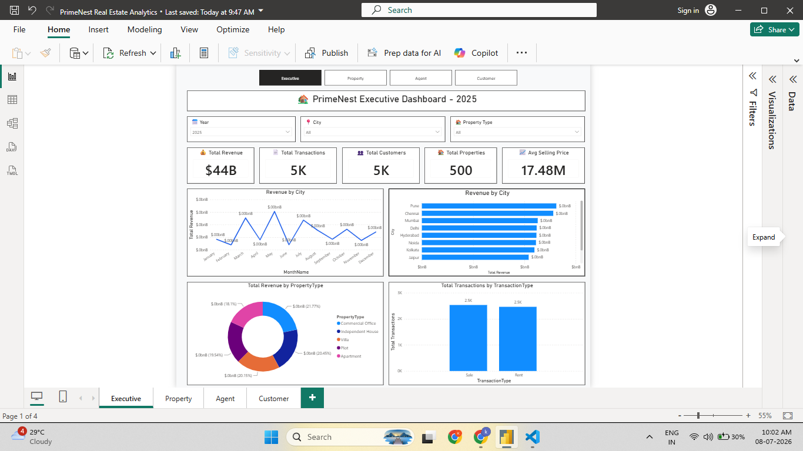
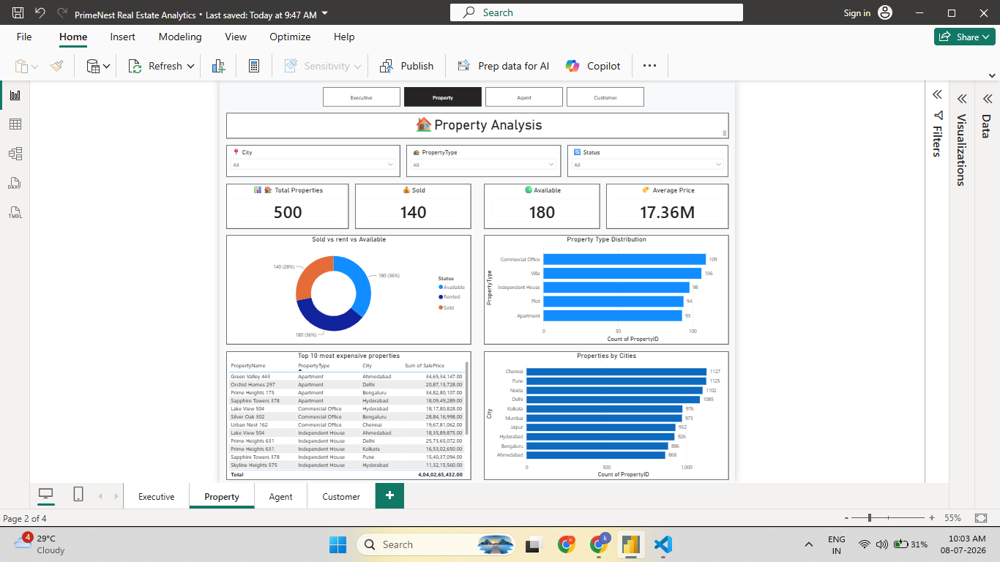
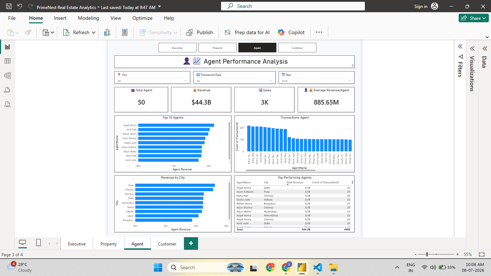
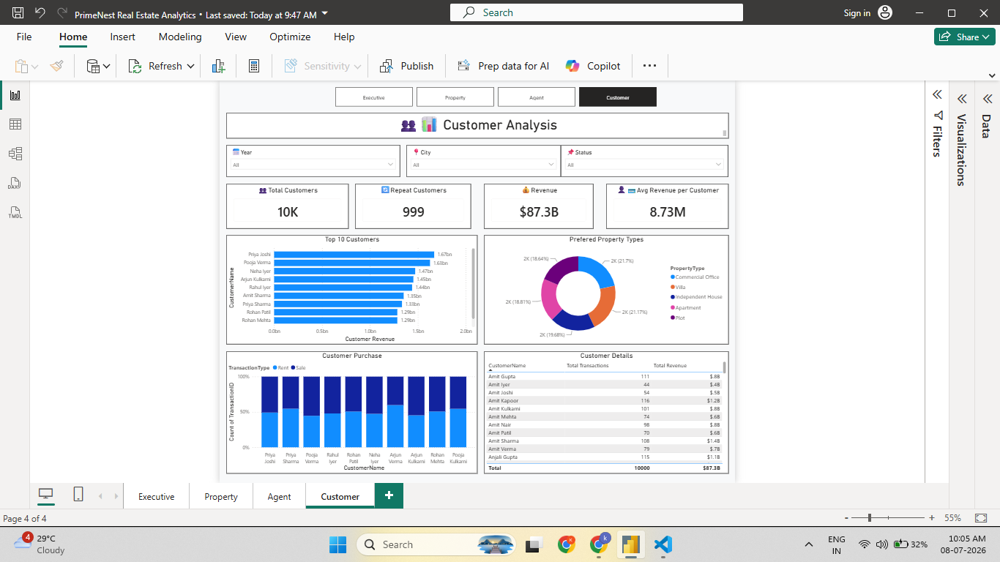

# 🏡 PrimeNest Real Estate Analytics

## 📖 Project Overview

PrimeNest Real Estate Analytics is an end-to-end data analytics project designed to analyze property transactions, customer behavior, agent performance, and revenue trends using modern data analytics tools.

The project demonstrates the complete analytics workflow—from data storage and ETL to interactive dashboards and business insights.

This project was built to showcase practical Data Analyst skills including SQL, Python, MySQL, Power BI, DAX, and data visualization.


## 🎯 Project Objectives

- Analyze property sales and rental transactions
- Monitor revenue performance across cities
- Evaluate agent performance
- Understand customer purchasing behavior
- Build interactive Power BI dashboards
- Automate CSV data loading using Python

## 🛠️ Tech Stack

- SQL
- MySQL
- Python
- Pandas
- SQLAlchemy
- Power BI
- DAX
- Git
- GitHub

## 🏗️ Project Architecture

CSV Files
↓
Python ETL (Pandas + SQLAlchemy)
↓
MySQL Database
↓
Power BI
↓
Interactive Dashboards
↓
Business Insights

## 📂 Project Structure

```text
PrimeNest-RealEstate-Analytics
│
├── Data
├── Images
├── PowerBI
├── Python
├── SQL
├── README.md
├── requirements.txt
└── LICENSE
```

## 📊 Dashboard Preview

### 🏠 Executive Dashboard



---

### 🏡 Property Analysis Dashboard



---

### 👨‍💼 Agent Performance Dashboard



---

### 👥 Customer Analysis Dashboard



## ⭐ Key Features

- Interactive Power BI dashboards
- End-to-end ETL pipeline using Python
- MySQL relational database with star schema
- Dynamic KPI cards using DAX
- Interactive slicers and filters
- Revenue analysis by city and property type
- Agent performance tracking
- Customer purchasing behavior analysis
- SQL interview practice queries

## 🗄️ Database Design

The project follows a **Star Schema** consisting of:

### Fact Table
- FactPropertyTransactions

### Dimension Tables
- DimCustomer
- DimAgent
- DimProperty
- DimLocation
- DimDate

## 🔄 ETL Workflow

1. Raw CSV files are stored in the Data folder.
2. Python (Pandas + SQLAlchemy) reads each CSV file.
3. Data is loaded into MySQL tables.
4. Power BI connects directly to the MySQL database.
5. DAX measures are used to create KPIs and business insights.

## 🔄 ETL Workflow

1. Raw CSV files are stored in the Data folder.
2. Python (Pandas + SQLAlchemy) reads each CSV file.
3. Data is loaded into MySQL tables.
4. Power BI connects directly to the MySQL database.
5. DAX measures are used to create KPIs and business insights.

## 🚀 Getting Started

### Clone the Repository

```bash
git clone https://github.com/<your-username>/PrimeNest-RealEstate-Analytics.git
```

### Install Python Dependencies

```bash
pip install -r requirements.txt
```

### Load Data into MySQL

```bash
python Python/load_data.py
```

### Open Power BI

Open the `.pbix` file located in the `PowerBI` folder and update the database connection if required.

## 🔮 Future Enhancements

- Deploy dashboards using Power BI Service
- Add AI-powered business insights
- Automate ETL scheduling
- Connect to cloud databases
- Add predictive analytics using Python

## 👨‍💻 Author

**Kaustubh Waghmare**

Data Analyst passionate about SQL, Python, Power BI, and Business Intelligence.

- GitHub: https://github.com/Kaustubhsw9
- LinkedIn: www.linkedin.com/in/kaustubhwaghmare